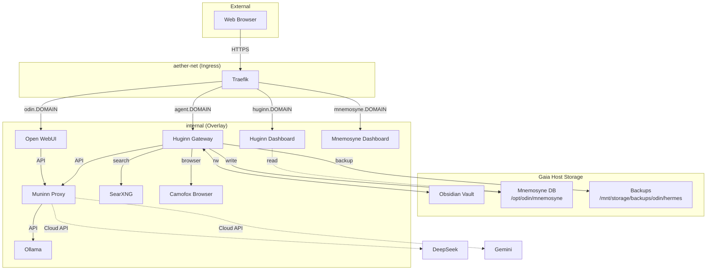

# Odin: AI Orchestration Stack

Odin is the central AI stack for the Yggdrasil home server ecosystem. It runs Hermes Agent (Huginn), Ollama, Muninn (LiteLLM proxy), Open WebUI, and supporting backup services in Docker Swarm on the Gaia host.

---

## Services

| Service | Image | Purpose |
|---------|-------|---------|
| ollama | ollama/ollama:latest | Local LLM inference (CPU-only, 4 CPUs / 12GB RAM) |
| muninn-db | postgres:16-alpine | LiteLLM database |
| muninn | ghcr.io/berriai/litellm-database:main-latest | API proxy — routes all LLM calls with observability |
| open-webui | ghcr.io/open-webui/open-webui:main | Chat UI (LLDAP auth via Cerberus) |
| huginn-gateway | custom (hermes-agent/Dockerfile) | Hermes Agent API server |
| huginn-dashboard | custom (same Dockerfile) | Hermes web dashboard |
| mnemosyne-dashboard | custom (mnemosyne-dashboard/Dockerfile) | Memory visualizer |
| huginn-backup | alpine + sqlite | Nightly SQLite backups, 30-day retention |
| odin-git-backup | custom (git-backup/Dockerfile) | Nightly git backup of /opt/odin (IaC) |
| searxng | searxng/searxng:latest | Self-hosted metasearch engine — Hermes web_search backend |
| camofox | ghcr.io/redf0x1/camofox-browser | Anti-detection browser — Hermes stealth browser (Firefox + C++ fingerprint spoofing) |

## Architecture



Two networks: `aether-net` (external, shared with Traefik) and `internal` (isolated overlay).

---

## LLM Backend

Ollama is installed for local inference but the Gaia host is CPU-only — Qwen 2.5 was too slow for agent workloads. Pivoted to DeepSeek as the primary backend, routed through Muninn to preserve unified observability:

```
Hermes Agent → Muninn (http://muninn:4000/v1) → DeepSeek API
```

Current models: `deepseek-v4-pro` (agent reasoning), `deepseek-v4-flash` (memory consolidation), `local-model:latest` (Open WebUI default, lightweight local).

Live model switching via `/model` command in any chat interface.

---

## Accessing Huginn

- **Discord Bot** — mention the bot in allowed channels. `/new` to reset.
- **Huginn Dashboard** — `https://huginn.DOMAIN` — chat, sessions, skills, memory.
- **Open WebUI** — `https://odin.DOMAIN` — select `hermes-agent` model.
- **Direct API** — `POST https://agent.DOMAIN/v1/chat/completions` (OpenAI-compatible).
- **Mnemosyne** — `https://mnemosyne.DOMAIN` — memory constellation map and timeline.

---

## Deploying

Prerequisites: environment variables in `.env` or GitHub Secrets.

```bash
# Direct (from Swarm manager)
docker stack deploy -c docker-compose.yml odin

# Remote trigger (from inside Hermes container)
gh workflow run deploy --repo yggdrasil-lab/odin
```

Deploy workflow runs on the self-hosted `gaia` runner. Pushes to main auto-trigger deploy.

---

## Details

Full documentation with service deep-dives, deployment pipeline, backup architecture, Hermes container internals, and pitfalls: see the Odin Stack reference in the vault under `Areas/90-Infrastructure/Odin/Odin Stack.md`.
