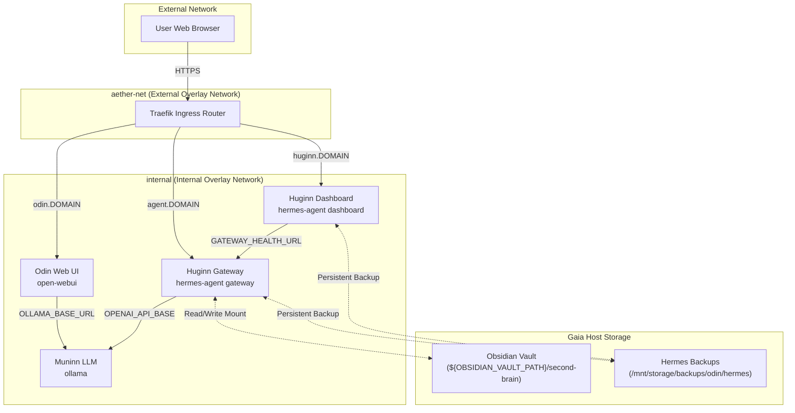

# Odin: The Central AI Orchestration Stack

Odin is the central services stack designed to host local Large Language Models (LLMs) and autonomous agent services for the **Yggdrasil** home server ecosystem. It runs in Docker Swarm mode on the **Gaia** host, integrated with Traefik for automatic TLS termination and routing.

---

## Architecture Overview

Odin connects Ollama (providing model execution) with Open-WebUI (for human interaction) and the Hermes Agent (functioning as the background execution agent "Huginn").



---

## Detailed Service Specifications

### 1. Muninn LLM (Ollama)
*   **Image:** `ollama/ollama:latest`
*   **Service Name:** `ollama`
*   **Resource Limits:** Restricted to `4.0` CPUs and `12GB` memory limit.
*   **Optimization:** Configured with `OLLAMA_FLASH_ATTENTION=1` and `OLLAMA_KV_CACHE_TYPE=q8_0` for CPU efficiency on Gaia.
*   **Custom Model Configuration:** Runs a customized Qwen model named `qwen-muninn:latest` with a customizable context window (defined via environment variables).

### 2. Odin Web UI (Open-WebUI)
*   **Image:** `ghcr.io/open-webui/open-webui:main`
*   **Service Name:** `open-webui`
*   **Routing:** Routed via Traefik to `https://odin.${DOMAIN_NAME}` (port `8080`).
*   **Integration:** Communicates with Ollama over the `internal` overlay network via `http://ollama:11434`.
*   **Authentication (LLDAP):** Integrated with the `cerberus_lldap` service (port `3890`) on the shared `aether-net` network, enabling centralized user authentication. It uses the external Docker Secret `odin_lldap_user_pass` to bind securely.

### 3. Huginn Gateway (Hermes Agent API)
*   **Image:** `nousresearch/hermes-agent:latest`
*   **Command:** `gateway run`
*   **Routing:** Exposed via Traefik to `https://agent.${DOMAIN_NAME}` (port `8642`).
*   **Storage Mounts:**
    *   **Obsidian Vault:** Host path `${OBSIDIAN_VAULT_PATH}/second-brain` mounted to `/app/vault` with read-write (`rw`) permissions so the agent can interact with notes.
    *   **Hermes Data:** Host path `/opt/odin/hermes` mounted to `/opt/data` for active state, dynamic skills, and databases.
*   **LLM Connection:** Configured to talk to Muninn LLM (Ollama) using its OpenAI-compatible endpoint at `http://ollama:11434/v1` with the model `qwen-muninn:latest`.

### 4. Huginn Dashboard (Hermes Web UI)
*   **Image:** `nousresearch/hermes-agent:latest`
*   **Command:** `dashboard --host 0.0.0.0 --insecure`
*   **Routing:** Exposed via Traefik to `https://huginn.${DOMAIN_NAME}` (port `9119`).
*   **Storage Mounts:**
    *   **Hermes Data:** Host path `/opt/odin/hermes` mounted to `/opt/data` so it can access configuration, state, and skill files in sync with the gateway.
*   **Security Configuration:** Because the dashboard is run containerized behind a reverse proxy (Traefik), it binds to `0.0.0.0` inside its container isolation. The `--insecure` flag bypasses the agent's safety refusal to bind to wildcard addresses.

### 5. Huginn Backup (SQLite Database Snapshot Cron)
*   **Image:** `alpine:latest` (with dynamic `sqlite3` and `tzdata` installation)
*   **Service Name:** `huginn-backup`
*   **Frequency:** Runs daily at 3:00 AM.
*   **Purpose:** Takes hot, non-locking SQLite database backups (`.db`/`.sqlite` files) from `/opt/odin/hermes` to the `/mnt/storage/backups/odin/hermes` directory and prunes backups older than 30 days.
*   **Git Tracking:** Since active database and cache files inside `/opt/odin/hermes` are excluded in [.gitignore](.gitignore), only config files and custom python skills in `/opt/odin/hermes/skills/` are committed to the stack's Git repo, while databases are backed up via this service.

---

## Network & Traffic Routing

Odin uses two primary overlay networks:
1.  **`aether-net`:** An **external** overlay network shared with the Traefik ingress controller. Web-facing services (`open-webui`, `huginn-gateway`, and `huginn-dashboard`) attach to this network to receive incoming proxy traffic.
2.  **`internal`:** An isolated overlay network used for inter-service communication (e.g., Open-WebUI and Hermes Agent communicating with Ollama).

---

## Deployment & Configuration

### Prerequisites
Ensure the following environment variables are exported or placed in a `.env` file before deployment:

| Variable | Description | Example |
| :--- | :--- | :--- |
| `STACK_NAME` | The prefix name for swarm services | `odin` |
| `DOMAIN_NAME` | The root domain for DNS routing | `yggdrasil.local` |
| `OBSIDIAN_VAULT_PATH` | Host path containing your Obsidian Vault | `/mnt/storage/vaults` |
| `LLDAP_LDAP_BASE_DN` | The base DN of your LLDAP directory | `dc=yggdrasil,dc=local` |
| `LLDAP_LDAP_USER_PASS_NAME` | Name of the external LLDAP admin password Docker Secret | `cerberus_lldap_user_pass_<hash>` |

### Step 1: Host Preparation
Run the host preparation script to ensure required backup/data directories exist and have proper ownership:
```bash
chmod +x setup_host.sh
./setup_host.sh
```

### Step 2: Deployment
The stack can be deployed directly to Docker Swarm using standard commands, or via the bundled deploy helper script.

**Using the Helper Script (Recommended):**
The stack includes a helper script from the `ops-scripts` repository submodule:
```bash
# Deploys using configuration defined in .env
./scripts/deploy.sh odin docker-compose.yml
```

**Standard Docker Deployment:**
```bash
# Source environment variables if using .env
set -a && source .env && set +a

# Deploy stack
docker stack deploy -c docker-compose.yml odin
```

### Using Google Gemini (Optional Cloud Model)
Odin is configured to support Google Gemini models as an alternative to local CPU execution via Ollama. This runs through Muninn (LiteLLM) to preserve unified API logging and telemetry.

#### 1. Obtain a Gemini API Key
To obtain a developer API key:
1. Go to [Google AI Studio](https://aistudio.google.com/).
2. Sign in with your Google account.
3. Click the **Get API key** button in the sidebar.
4. Click **Create API key** (you can create it in a new or existing Google Cloud project).
5. Copy your generated key (`AIzaSy...`).

> [!NOTE]
> Google AI Studio provides a highly generous **Free Tier** (e.g., 15 RPM / 1M TPM for `gemini-2.5-flash`), which is completely free and ideal for a personal agent.

#### 2. Configure GitHub Secrets
Add the copied API key to your repository secrets:
* **Name:** `GEMINI_API_KEY`
* **Value:** `<your-gemini-api-key>`

#### 3. Update the Model in the Deployment Workflow
In [.github/workflows/deploy.yml](file:///g:/My%20Drive/Second%20Brain/Forge/odin/.github/workflows/deploy.yml), update the `AGENT_MODEL` environment variable to a Gemini model:
```yaml
    env:
      OLLAMA_BASE_MODEL: qwen2.5-coder:7b
      OLLAMA_CONTEXT_LENGTH: 16384
      HERMES_CONTEXT_LENGTH: 131072
      AGENT_MODEL: gemini-2.5-flash
      CHAT_MODEL: qwen2.5-muninn:latest
      OLLAMA_NUM_THREADS: 8
```
Once pushed to `main`, Muninn will automatically route all agent requests through Google's cloud API (with a 128K context window), while leaving Open-WebUI connected to your lightweight, fast, local CPU-based Ollama model (with a 16K context window). This avoids CPU/RAM strain on your local Gaia host while maximizing the agent's capabilities.

---

## Troubleshooting & Operations

### Checking Service Logs
To inspect logs for a specific service in the stack:
```bash
docker service logs -f odin_huginn-dashboard
docker service logs -f odin_huginn-gateway
```

### Rebuilding / Pulling Custom Models
To recreate the customized Ollama model manually:
1. Exec into the Ollama container:
   ```bash
   docker exec -it $(docker ps -q -f name=odin_ollama) ollama create qwen-muninn:latest -f /Modelfile
   ```

### Cleaning Up Old Models
When you change the base model (e.g., from `qwen2.5-coder:14b` to `qwen2.5-coder:7b`), the old base models and their unreferenced data blocks remain stored inside the persistent `ollama_data` Docker volume.

To free up disk space:
1. **List models inside the container**:
   You can run the helper script on the host:
   ```bash
   /opt/odin/scripts/clean_ollama_models.sh
   ```
   Or run the listing manually:
   ```bash
   docker exec -it $(docker ps -q -f name=odin_ollama) ollama list
   ```
2. **Remove the old base model**:
   To delete a model and free up its disk space, run:
   ```bash
   docker exec -it $(docker ps -q -f name=odin_ollama) ollama rm qwen2.5-coder:14b
   ```

### Database Backup & Restore

#### Manually Triggering a Backup
To run a database backup immediately (without waiting for the 3:00 AM cron):
```bash
docker exec -it $(docker ps -q -f name=odin_huginn-backup) /config/backup.sh
```

#### Restoring from Backup
A restore script is provided at [restore.sh](config/hermes-backup/restore.sh) to automatically scale down the services, copy database snapshots back to `/opt/odin/hermes`, and scale the services back up:

1. To restore the **latest** backups found:
   ```bash
   sudo ./config/hermes-backup/restore.sh
   ```
2. To restore a **specific** backup file:
   ```bash
   sudo ./config/hermes-backup/restore.sh /mnt/storage/backups/odin/hermes/hermes_backup_20260524_120000.db
   ```

---

## Interacting with the Huginn Agent

Odin is configured to expose multiple ways to chat and collaborate with the Huginn Agent from your PC or other devices:

### 1. Discord Bot (Push-based Chat)
If configured with `DISCORD_BOT_TOKEN`, the agent acts as a Discord bot. You can invoke it by mentioning it in allowed channels, and reset conversation sessions using the `/new` command.

### 2. Huginn Web Dashboard (Direct Control Panel)
You can access the dedicated Hermes Agent Web Dashboard directly in your browser:
* **URL:** `https://huginn.${DOMAIN_NAME}`
* **Features:** Allows you to chat with the agent, view active tasks, monitor step-by-step executions, inspect memories, and view/edit dynamic python skills.

### 3. Open-WebUI Integration (Auto-configured Chat Interface)
Odin is pre-configured to automatically link your Open-WebUI instance to the Huginn Gateway API server on startup.
* **Accessing the Agent**: Simply open Open-WebUI (`https://odin.${DOMAIN_NAME}`), and select the `hermes-agent` model from the top-left model selection dropdown.
* **Behavior**: Any chat started with the `hermes-agent` model will run actions (like reading notes from your Obsidian vault) and stream progress indicators directly into the Open-WebUI chat bubble. No manual connection setup is required.

### 4. Direct API / CLI Access
You can query the agent programmatically from your PC using `curl` or any OpenAI-compatible client library:
```bash
curl https://agent.${DOMAIN_NAME}/v1/chat/completions \
  -H "Authorization: Bearer <your-api-server-key>" \
  -H "Content-Type: application/json" \
  -d '{
    "model": "hermes-agent",
    "messages": [{"role": "user", "content": "list my top projects from obsidian"}]
  }'
```
