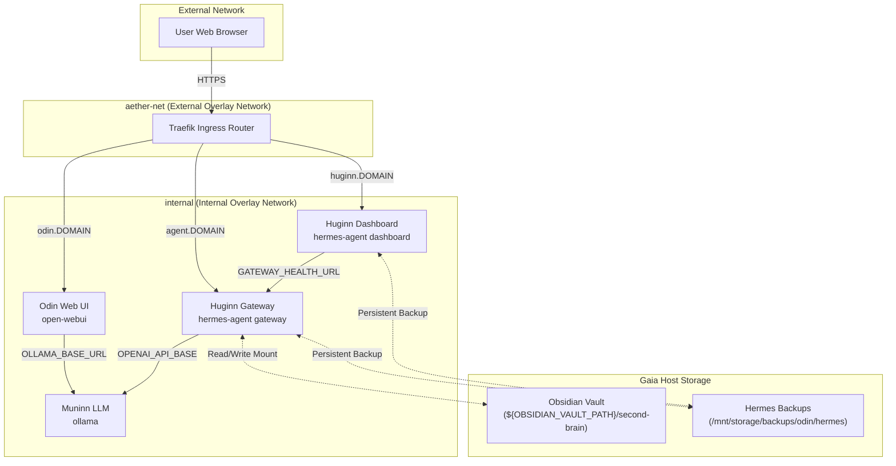

# Odin: The Central AI Orchestration Stack

Odin is the central services stack designed to host local Large Language Models (LLMs) and autonomous agent services for the **Yggdrasil** home server ecosystem. It runs in Docker Swarm mode on the **Gaia** host, integrated with Traefik for automatic TLS termination and routing.

---

## Architecture Overview

Odin connects Ollama (providing model execution) with Open-WebUI (for human interaction) and the Hermes Agent (functioning as the background execution agent "Huginn").



---

## Detailed Service Specifications

### 1. Muninn LLM (Ollama)
*   **Image:** `ollama/ollama:latest`
*   **Service Name:** `ollama`
*   **Resource Limits:** Restricted to `4.0` CPUs and `12GB` memory limit.
*   **Optimization:** Configured with `OLLAMA_FLASH_ATTENTION=1` and `OLLAMA_KV_CACHE_TYPE=q8_0` for CPU efficiency on Gaia.
*   **Custom Model Configuration:** Runs a customized `qwen2.5:7b-instruct` model named `qwen2.5-muninn:latest` with a **64k context window** (`num_ctx 65536`) defined via [Modelfile](Modelfile).

### 2. Odin Web UI (Open-WebUI)
*   **Image:** `ghcr.io/open-webui/open-webui:main`
*   **Service Name:** `open-webui`
*   **Routing:** Routed via Traefik to `https://odin.${DOMAIN_NAME}` (port `8080`).
*   **Integration:** Communicates with Ollama over the `internal` overlay network via `http://ollama:11434`.

### 3. Huginn Gateway (Hermes Agent API)
*   **Image:** `nousresearch/hermes-agent:latest`
*   **Command:** `gateway run`
*   **Routing:** Exposed via Traefik to `https://agent.${DOMAIN_NAME}` (port `8642`).
*   **Storage Mounts:**
    *   **Obsidian Vault:** Host path `${OBSIDIAN_VAULT_PATH}/second-brain` mounted to `/app/vault` with read-write (`rw`) permissions so the agent can interact with notes.
    *   **Hermes Data:** Host path `/opt/odin/hermes` mounted to `/opt/data` for active state, dynamic skills, and databases.
*   **LLM Connection:** Configured to talk to Muninn LLM (Ollama) using its OpenAI-compatible endpoint at `http://ollama:11434/v1` with the model `qwen2.5-muninn:latest`.

### 4. Huginn Dashboard (Hermes Web UI)
*   **Image:** `nousresearch/hermes-agent:latest`
*   **Command:** `dashboard --host 0.0.0.0 --insecure`
*   **Routing:** Exposed via Traefik to `https://huginn.${DOMAIN_NAME}` (port `9119`).
*   **Storage Mounts:**
    *   **Hermes Data:** Host path `/opt/odin/hermes` mounted to `/opt/data` so it can access configuration, state, and skill files in sync with the gateway.
*   **Security Configuration:** Because the dashboard is run containerized behind a reverse proxy (Traefik), it binds to `0.0.0.0` inside its container isolation. The `--insecure` flag bypasses the agent's safety refusal to bind to wildcard addresses.

### 5. Huginn Backup (SQLite Database Snapshot Cron)
*   **Image:** `alpine:latest` (with dynamic `sqlite3` and `tzdata` installation)
*   **Service Name:** `huginn-backup`
*   **Frequency:** Runs daily at 3:00 AM.
*   **Purpose:** Takes hot, non-locking SQLite database backups (`.db`/`.sqlite` files) from `/opt/odin/hermes` to the `/mnt/storage/backups/odin/hermes` directory and prunes backups older than 30 days.
*   **Git Tracking:** Since active database and cache files inside `/opt/odin/hermes` are excluded in [.gitignore](.gitignore), only config files and custom python skills in `/opt/odin/hermes/skills/` are committed to the stack's Git repo, while databases are backed up via this service.

---

## Network & Traffic Routing

Odin uses two primary overlay networks:
1.  **`aether-net`:** An **external** overlay network shared with the Traefik ingress controller. Web-facing services (`open-webui`, `huginn-gateway`, and `huginn-dashboard`) attach to this network to receive incoming proxy traffic.
2.  **`internal`:** An isolated overlay network used for inter-service communication (e.g., Open-WebUI and Hermes Agent communicating with Ollama).

---

## Deployment & Configuration

### Prerequisites
Ensure the following environment variables are exported or placed in a `.env` file before deployment:

| Variable | Description | Example |
| :--- | :--- | :--- |
| `STACK_NAME` | The prefix name for swarm services | `odin` |
| `DOMAIN_NAME` | The root domain for DNS routing | `yggdrasil.local` |
| `OBSIDIAN_VAULT_PATH` | Host path containing your Obsidian Vault | `/mnt/storage/vaults` |

### Step 1: Host Preparation
Run the host preparation script to ensure required backup/data directories exist and have proper ownership:
```bash
chmod +x setup_host.sh
./setup_host.sh
```

### Step 2: Deployment
The stack can be deployed directly to Docker Swarm using standard commands, or via the bundled deploy helper script.

**Using the Helper Script (Recommended):**
The stack includes a helper script from the `ops-scripts` repository submodule:
```bash
# Deploys using configuration defined in .env
./scripts/deploy.sh odin docker-compose.yml
```

**Standard Docker Deployment:**
```bash
# Source environment variables if using .env
set -a && source .env && set +a

# Deploy stack
docker stack deploy -c docker-compose.yml odin
```

---

## Troubleshooting & Operations

### Checking Service Logs
To inspect logs for a specific service in the stack:
```bash
docker service logs -f odin_huginn-dashboard
docker service logs -f odin_huginn-gateway
```

### Rebuilding / Pulling Custom Models
To recreate the customized Ollama model with the 64k context window:
1. Exec into the Ollama container:
   ```bash
   docker exec -it $(docker ps -q -f name=odin_ollama) ollama create qwen2.5-muninn:latest -f /Modelfile
   ```

### Database Backup & Restore

#### Manually Triggering a Backup
To run a database backup immediately (without waiting for the 3:00 AM cron):
```bash
docker exec -it $(docker ps -q -f name=odin_huginn-backup) /config/backup.sh
```

#### Restoring from Backup
A restore script is provided at [restore.sh](config/hermes-backup/restore.sh) to automatically scale down the services, copy database snapshots back to `/opt/odin/hermes`, and scale the services back up:

1. To restore the **latest** backups found:
   ```bash
   sudo ./config/hermes-backup/restore.sh
   ```
2. To restore a **specific** backup file:
   ```bash
   sudo ./config/hermes-backup/restore.sh /mnt/storage/backups/odin/hermes/hermes_backup_20260524_120000.db
   ```
